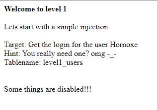

## Người thực hiện: Trần Ngọc Nam
## Thời gian thực hiện: 3/5/2022

- Khi bắt đầu level, ta sẽ có một số gợi ý như user là <code>Hornoxe</code> và tablename là <code>level1_users</code>.
- Vì đây là lỗi sql cơ bản nên ta sẽ thử dùng union để tấn công.
- Sử dụng <code>union select 1</code> và tăng dần lên để kiểm tra số cột và tìm được cột bị lỗi.
- Ta sẽ nhận ra điều khác biệt ở <code>union select 1,2,3,4</code> nên rất có thể cột số 4 là cột lỗi.
  
- Ta sẽ thử kiểm tra version với <code>union select 1,2,3,@@version</code>Ta sẽ thử kiểm tra version với <code>union select 1,2,3,@@version</code>
  
- Như vậy, ta đã có được phiên bản của database là <code>5.5.62-0+deb8u1</code>
- Tiếp theo ta sẽ kiểm tra các bảng với <code>union select 1,2,3,table_name from information_schema.tables</code> và kiểm tra cột của table với <code>union select 1,2,3,column_name from information_schema.columns where table_name=(table_name)</code>. Nhưng lúc này, trang web sẽ báo là tính năng này đã bị vô hiệu hóa.
  
- Lúc này ta sẽ dùng đến gợi ý. Vì ta đã có được user và tablename, nên lúc này ta cần có được password. Nên ta sẽ thử liệt kê password từ table <code>level1_users</code>
  
- Ta có được passowrd là <code>thatwaseasy</code>. Kết hợp với user <code>Hornoxe</code> để đăng nhập.
  
- Như vậy, là ta đã đăng nhập thành công.