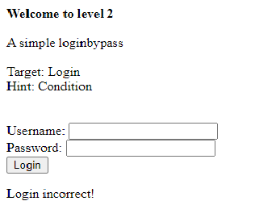
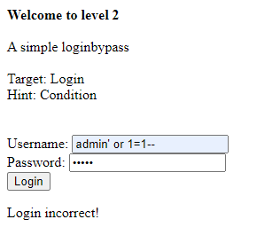
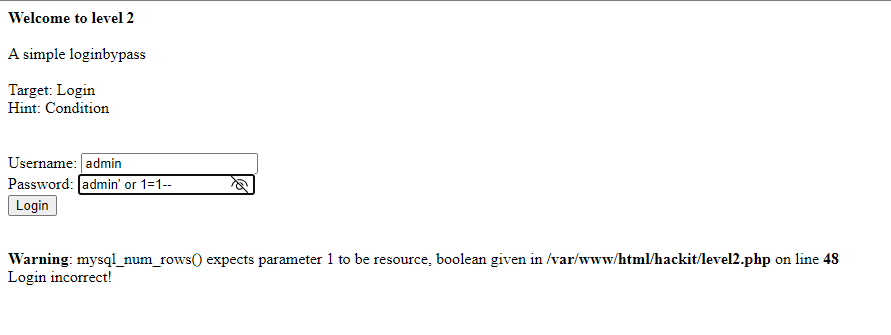
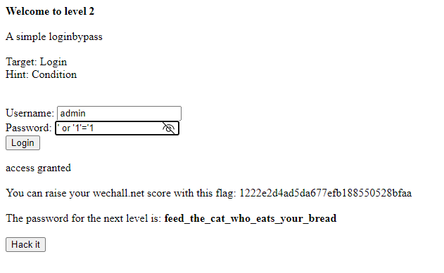

## Người thực hiện: Trần Ngọc Nam
## Thời gian thực hiện: 3/5/2022

- Ở level 2, ta sẽ thực hiện loginbypass.
- Ta sẽ thực hiện thử đăng nhập với username và password bất kì để kiểm tra trạng thái trả về.
  
  

- Nhưng trạng thái trả về không có bất kì bất thường nào.
- Lúc này, ta thử <code>admin' or 1=1--</code> vào username.
  
  

- Trạng thái trả về vẫn không có sự khác biệt.
- Ta thử <code>admin' or 1=1--</code> ở phần password.
  
  

- Từ trạng thái trả về, ta có thể suy đoán có thể tấn công boolean ở password. Nhưng câu truy vấn ở dây chưa đúng. Lần này, ta sẽ dùng <code>' or '1'='1</code>
  
 

- Như vậy, là ta đã đăng nhập thành công.