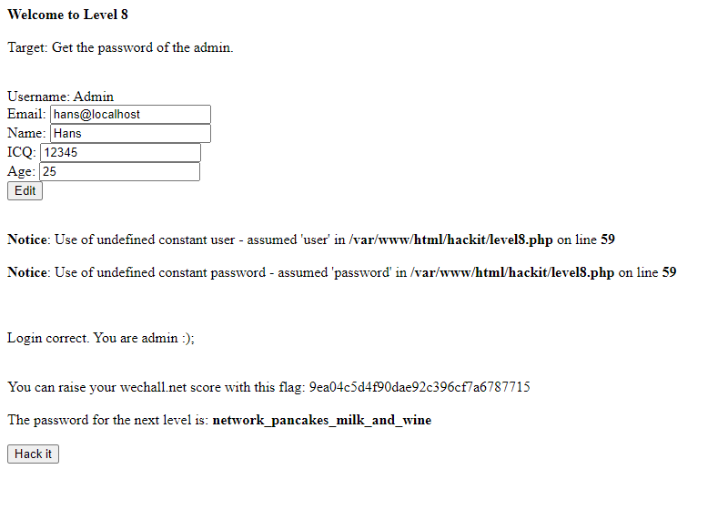

## Người thực hiện: Trần Ngọc Nam
## Thời gian thực hiện: 8/5/2022

- Đầu tiên, ta thử thêm <code>'</code> để xem lỗi trả về.
  
  

- Tiếp theo, ta vẫn sẽ thử kiểm tra số cột với <code>' union select 1,2,3,4,5#</code>.
  
  

- Lúc này kết quả trả về <code>union slelect 1,2,3,4,5#', icq = '12345', age = '25' WHERE id = 1</code>.
- Ta sẽ lợi kết quả lỗi ban đầu và lỗi khi kết hợp union bằng cách chèn <code>hans@localhost', name=(password), icq='</code>.
  
  

- Lúc này cột name đã thay đổi thành password là <code>19JPYS1jdgvkj</code>. Ta thử đăng nhập và thành công.
  
  